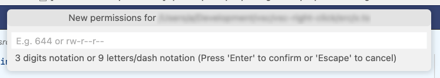
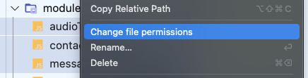
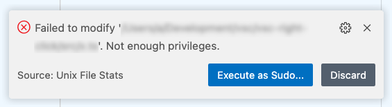
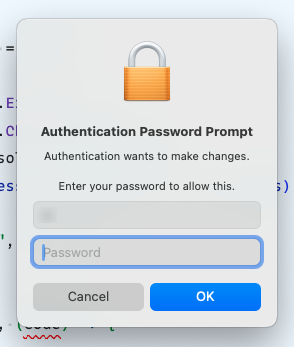

# unix-file-stats

Add file stats information in your editor status bar in Unix and Unix-like operating systems (tested on macOS Sonoma & Debian Sid).

## Features

 - Shows file permissions (file mode)
 - Shows file size
 - Allow to change file permissions (with sudo retry support)

After installing, the file size and permissions for the current file will appear as a new statusbar item . If file is readonly, the item background will change .

You can change the file permissions by clicking on the status item.

It's also possible to change the file permissions from the explorer tree by clicking in the added menu item 'Change file permissions'. This function supports multiple files. Directories are ignored.

If changing permissions require superuser privileges, it's possible to try again with sudo.

## Extension Settings

This extension contributes the following settings:

* `fileStats.size.enabled`:             Displays the file size on the status bar.
* `fileStats.size.position`:            Sets the position (left or right) of the file size status item.
* `fileStats.size.priority`:            A higher number means nearer to the left.
* `fileStats.permissions.enabled`:      Displays the file permissions on the status bar.
* `fileStats.permissions.position`:     Sets the position (left or right) of the file permissions status item.
* `fileStats.permissions.priority`:     A higher number means nearer to the left.
* `fileStats.permissions.format`:       Sets the permissions format (numeric or letters/-).
* `fileStats.permissions.warnReadonly`: Shows the permissions menu item with a warning background when file in not writeable.
* `fileStats.hints.basenameOnly`:       Displays only the resource's basename when requesting the permissions.
* `fileStats.hints.maxNames`:           The maximum names to display when requesting the permissions. If more items than this value are selected, they will appear as ' and X more'

## Release Notes

See the [changelog](./CHANGELOG.md).

## Contributing

First of, thanks for your interest in helping out!

This repository uses ESLint and [Stylistic](https://eslint.style/) to ensure the code quality. Lefthook is configured to automatically perform tasks on pre-commit and pre-push hooks. Execute `npm run prepare` to install the git hooks in your cloned repo. [Commitlint](https://commitlint.js.org/) is integrated as a github workflow to ensure consistent commit messages on PRs.

### Pre-commit

Before committing, eslint will run on staged files. If everything is ok, the commit messages will be linted too using the default conventional configuration. See [commitlint.config.mjs](./commitlint.config.mjs) for a cheat sheet on how to use the types or [https://cheatsheets.zip/conventional-commits](https://cheatsheets.zip/conventional-commits) for a detailed explanation.

### Pre-push

Before pushing, a package audit is going to be performed to verify there are no risky packages as dependencies.

## License

See the [license](./LICENSE.md).
