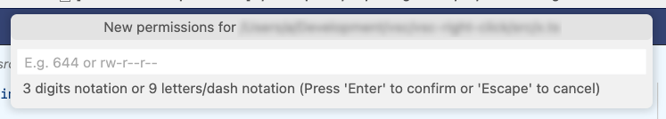
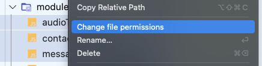
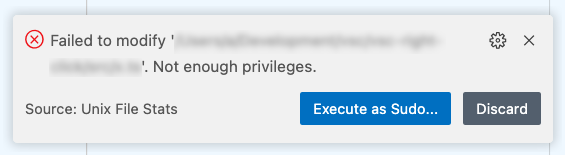
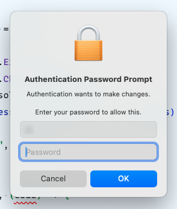

# Unix File Stats

> Add file stats information in your editor status bar in Unix and Unix-like operating systems (tested on macOS Sonoma/Sequoia & Debian Sid).

 
Is this extension helpful for you? I kindly ask you to consider supporting me if you're able to, it will mean the world to me ❤️. Regardless, happy coding!

## Features

 - Shows file permissions (file mode)
 - Shows file size
 - Allow to change file permissions (with sudo retry support)

After installing, the file size and permissions for the current file will appear as a new statusbar item . If file is readonly, the item background will change .

You can change the file permissions by clicking on the status item.

It's also possible to change the file permissions from the explorer tree by clicking in the added menu item 'Change file permissions'. This function supports multiple files. Directories are ignored.

If changing permissions require superuser privileges, it's possible to try again with sudo.

## Extension Settings

This extension contributes the following settings:

* `fileStats.size.enabled`:             Displays the file size on the status bar.
* `fileStats.size.position`:            Sets the position (left or right) of the file size status item.
* `fileStats.size.priority`:            A higher number means nearer to the left.
* `fileStats.permissions.enabled`:      Displays the file permissions on the status bar.
* `fileStats.permissions.position`:     Sets the position (left or right) of the file permissions status item.
* `fileStats.permissions.priority`:     A higher number means nearer to the left.
* `fileStats.permissions.format`:       Sets the permissions format (numeric or letters/-).
* `fileStats.permissions.warnReadonly`: Shows the permissions menu item with a warning background when file in not writeable.
* `fileStats.hints.basenameOnly`:       Displays only the resource's basename when requesting the permissions.
* `fileStats.hints.maxNames`:           The maximum names to display when requesting the permissions. If more items than this value are selected, they will appear as ' and X more'

## Release Notes

See the [changelog](./CHANGELOG.md).

## Contributing

First of, thanks for your interest in helping out!

There are a set of tool configured to ease development:
 - Git hooks configured via [Lefthook](https://lefthook.dev/)
 - Github PR title linted via [Commitlint](https://commitlint.js.org/)
 - Versioning managed via [cliff-jumper](https://github.com/favware/cliff-jumper)

Lefthook is configured to automatically perform tasks on pre-commit and pre-push hooks.
To install the git hooks in your cloned repo run `npm run prepare`.
This way, [the configured hooks](./lefthook.yml) will be automatically executed.

When creating a PR, the title will be automatically linted with a [github workflow](./.github/workflows/semantic-pull-request.yml)
to ensure it's conformant with the [conventional commit structure](https://www.conventionalcommits.org/en/v1.0.0/).
Failing to comply wont let the PR to merge. This is important because the versioning tool
uses the commit messages to define the version change.

## Testing

Tests are located in `src/test/`. Run `npm test` to execute the test suite.

## Versioning and releasing

Once you're in the main branch with all changes merged and ready to release a new version:

Use `npm run pub:bump` to increment the version and update the changelog and commit the changes. Internally,
`pub:bump` uses cliff-jumper to automatize the process.

To undo a bump, use `npm run pub:debump {generated tag}` which undoes the commit and deletes the tag. E.g.:
`npm run pub:debump v0.5.0`

Finally, run `npm run pub:release` to push the changes along with the new tag.
Pushing the tag will trigger a workflow that creates a new Github release and publishes the new version in the Marketplace and the Open VSX Registry.

## License

See the [license](./LICENSE.md).
